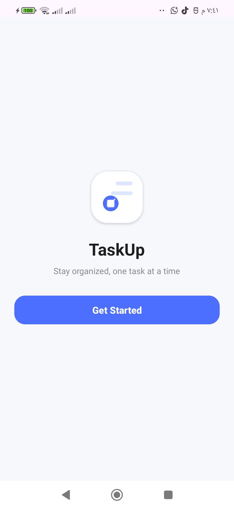
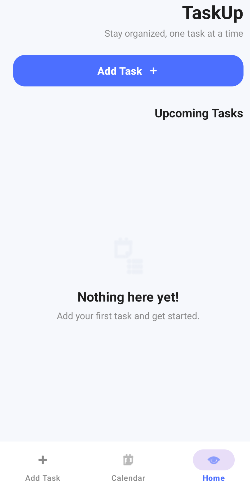
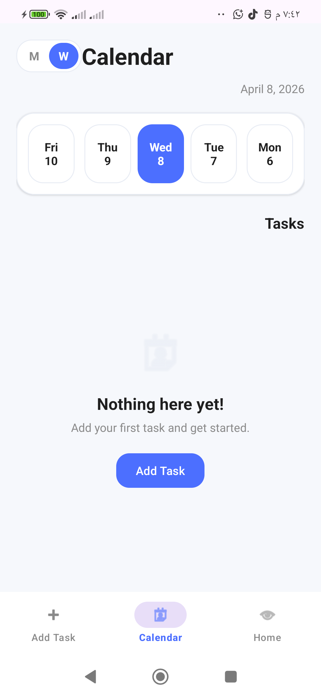
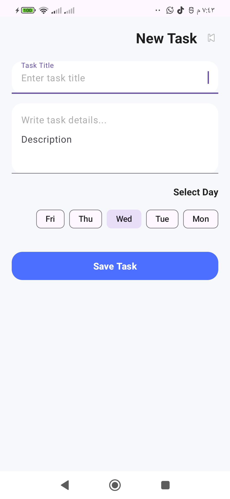

# 📱 TaskUp

TaskUp is a simple and clean Android to-do list application built with **Kotlin** and **XML**.  
The app helps users organize daily tasks, mark them as completed, delete them, and browse tasks through a calendar-style screen.

## ✨ Features
- ✅ Add new tasks with title & description
- 🗑️ Delete tasks easily
- ✔️ Mark tasks as completed
- 🏠 Clean home screen with task list
- 📅 Calendar screen to browse tasks by day
- 🎨 Modern UI with Material Design

## 🛠️ Tech Stack
- **Language:** Kotlin
- **UI:** XML Layouts
- **Components:** RecyclerView, Material Design
- **Tools:** Android Studio, Gradle

## 📂 Project Structure
app/
├── MainActivity.kt # Home screen
├── CalendarActivity.kt # Calendar view
├── AddTaskActivity.kt # Add new task
├── Task.kt # Data model
├── TaskAdapter.kt # RecyclerView adapter
└── TaskRepository.kt # Data management

## 📸 Screenshots

| Splash Screen | Home Screen |
|:-------------:|:-----------:|
|  |  |

| Calendar View | Add Task |
|:-------------:|:--------:|
|  |  |


## 🚀 Getting Started

### Prerequisites
- Android Studio (Arctic Fox or later)
- JDK 11+
- Android device or emulator

### Installation
1. Clone the repository:
```bash
git clone https://github.com/mohamed552m/TaskUp.git
Open the project in Android Studio
Build and run the app
📖 Usage
Open the app to view your tasks
Tap the + button to add a new task
Use the calendar to filter tasks by day
Check the box to mark task as complete
Swipe or long-press to delete tasks
🤝 Contributing
Contributions are welcome! Feel free to:
Fork the repository
Create a feature branch
Submit a Pull Request
📄 License
This project is open source and available under the MIT License.
📬 Contact
Mohamed - @mohamed552m
Project Link: https://github.com/mohamed552m/TaskUp
